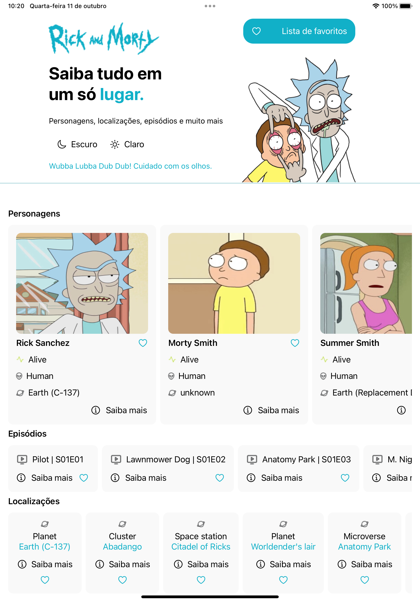

# Rick and Morty - Aplicativo em SwiftUI




> Aplicativo sobre informativos do Rick and Morty... personagens, episódios e planetas.

### Ajustes e melhorias

O projeto ainda está em desenvolvimento e as próximas atualizações serão voltadas nas seguintes tarefas:

- [x] Layout da Home
- [x] Chamada de API
- [ ] Arquitetura
- [ ] Tela de detalhes dos Personagens
- [ ] Tela de detalhes dos Episódios
- [ ] Tela de detalhes dos Planetas

## 💻 Pré-requisitos

Antes de começar, verifique se você atendeu aos seguintes requisitos:

* Você instalou a versão mais recente de `<Swift / XCode>`
* Você tem uma máquina `<Mac>`. O sistema operacional Windows e Linux não são compatíveis.


## ☕ Usando Rick and Morty - Aplicativo em SwiftUI

Para usar Rick and Morty - Aplicativo em SwiftUI, siga estas etapas:

```
Abrir o xcode, com o emulador do iPad.

```

## Figma:

https://www.figma.com/file/ciOQBs4e7JqhLZPPuzBagP/Rick-and-Morty-(Community)?type=design&node-id=135-10917&mode=design&t=uHDtW46D08RmT6Kr-0

## API:

https://rickandmortyapi.com/
